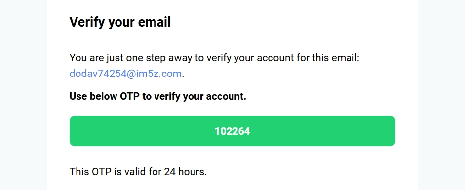

# MERN Authentication

A professional, secure, and modern authentication system built with the MERN stack. Features include OTP verification via Gmail, JWT-based authentication, bcrypt password hashing, and robust security best practices. The frontend is crafted with React.js and Tailwind CSS for a seamless user experience.

---

## ✨ Features

- **OTP Verification:** Secure one-time password sent to user’s Gmail for authentication.
- **RESET Password functionality:** Reset password by verifying otp.
- **JWT Authentication:** Stateless and secure session management.
- **Bcrypt Password Hashing:** Strong password encryption for user data protection.
- **Modern UI:** Responsive and attractive interface using React.js & Tailwind CSS.
- **Hardened Security:** Follows best practices to prevent common vulnerabilities.

---

## 🚀 Getting Started

### 1. Clone the Repository

```bash
git clone https://github.com/roshan-metrix/MERN_Authentication.git
cd MERN_Authentication
```

### 2. Backend Setup

```bash
cd backend
npm install
```

#### Create a `.env` file in the `backend` directory:

```env

PORT =  any port i.e 3000 
# Use mongodb Atlas or local server
MONGODB_URI = Your Mongodb url or locally : 'mongodb://localhost:27017' 

#Json Web Token secret
JWT_SECRET = ''

# node_env -> development / production
NODE_ENV = 'development'

# I have use google smtp; u can use any smtp mail provider
SMTP_USER = "example"
SMTP_PASS = "abcdefghijs" # app pass google
SENDER_EMAIL = "example@gmail.com"

FRONTEND_URI = ''
```

> **Note:** Use [Gmail App Passwords](https://support.google.com/accounts/answer/185833) for secure email sending.

Start the backend server:

```bash
npm run server
```

---

### 3. Frontend Setup

```bash
cd ../client
npm install
```

Start the frontend development server:

```bash
npm run dev
```

---

## 🛡️ Security Highlights

- Environment variables for sensitive data
- Rate limiting and input validation
- Secure HTTP headers
- Passwords never stored in plain text

---

## Screenshot

<div align="center" style="display: flex; flex-wrap: wrap; justify-content: center; gap: 16px; max-width: 800px; margin: auto;">


</div>

<div align="center" style="max-width: 800px; margin: auto;">





</div>


## 📄 License

This project is licensed under the [MIT License](license.txt).

---

> **Ready to use, secure, and scalable authentication for your next MERN project,enjoy it!**

